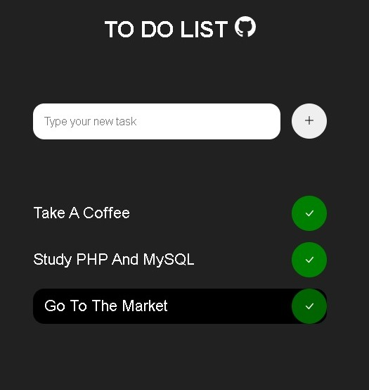

# TO DO List in JavaScript

A simple "to do list" in JavaScript for study purposes.
Feel free to clone this repository and make your changes.

Features:
- Write data to local memory;
- Doesn't need a DB;
- Animations made in CSS.

## Screenshot

